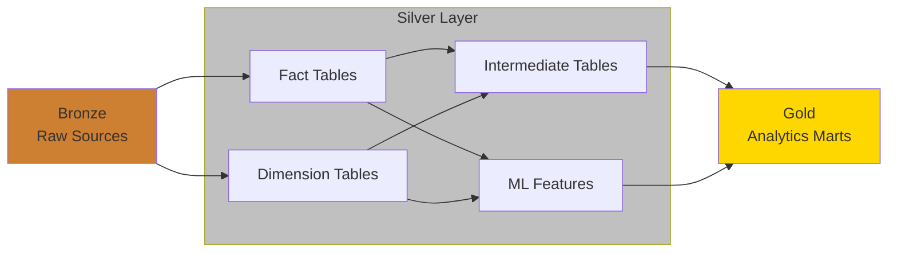

 

## Running The App

Clone the Repo & run `make up` which will spin up a Postgres Database w/ bootstrapped data to test the project with.

From there you can use Poetry to setup a local Environment w/ the appropriate dbt Packages by running `poetry install --with dev`.

You must also have a `~/.dbt/profiles.yml` setup with the following Config:

```yml
default:
  outputs:
    default:
      type: postgres
      host: localhost
      port: 5432
      dbname: jacob_db
      schema: public
      user: postgres
      password: postgres
```

When finished run `make down` to spin the Postgres Container down.

## Tests

To run tests locally, run `make test`. This spins up a Postgres Database w/ bootstrapped data and runs `dbt build` to build & test every model in the project.

- The same test suite runs on every commit to a PR via GitHub Actions

## dbt Project Structure

This project follows a medallion architecture:



Bronze -> Silver -> Gold

- Bronze: Raw source data
- Silver: Transformed data
  - Fact and dimension tables standardize column names, enforce data types, and perform light cleaning on bronze tables
  - Intermediate tables build custom models from fact/dimension tables for the dashboard, API, and ML pipeline. They also enable an initial layer of data quality testing before reaching the Gold layer and introducing potential issues to downstream services
- Gold: Final analytics-ready marts built from intermediate tables and ML Pipeline

_Note: A `scratch/` folder exists for ad hoc analytics and experimental work._

## NBA Project


1. Links to other Repos providing infrastructure for this Project
   - [Dash Server](https://github.com/jyablonski/nba_elt_dashboard)
   - [Ingestion Script](https://github.com/jyablonski/nba_elt_ingestion)
   - [Terraform](https://github.com/jyablonski/aws_terraform)
   - [ML Pipeline](https://github.com/jyablonski/nba_elt_mlflow)
   - [REST API](https://github.com/jyablonski/nba_elt_rest_api)
   - [Internal Documentation](https://github.com/jyablonski/doqs)
